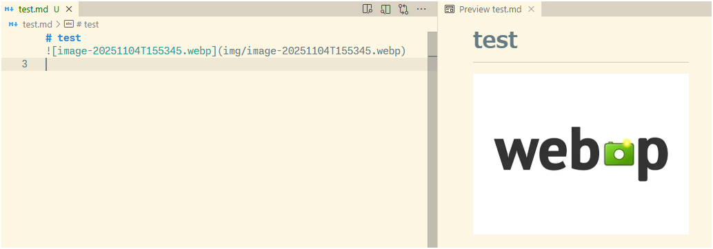

# WebP Image Paster

[English README](README.md)

クリップボード画像をWebP形式に変換し, Markdownファイルに直接貼り付けるVSCode拡張機能です。



## 目的,機能

- **ファイルサイズ削減** - WebPはPNG/JPEGより25-80%小さいファイル
- **ワークフロー効率化** - クリップボードからMarkdownへ直接貼り付け
- **クロスプラットフォーム** - Windows、macOS、Linuxや，リモート(WSL、ssh、devcontainer) で動作

## インストール

1. VSCode Marketplaceからインストール
2. 追加セットアップ不要

## 使い方

1. 画像をクリップボードにコピー
2. VSCodeでMarkdownファイルを開く
3. `Ctrl+V`（MacではCmd+V）を押す

**その他の方法:**

- コマンドパレット → "Paste as WebP in MD"

## ⚙️ 設定

詳細は設定の説明文を参照

```json
{
  "vsc-webp-paster.imageDir": "img",
  "vsc-webp-paster.quality": 80,
  "vsc-webp-paster.namingConvention": "image-${timestamp}",
  "vsc-webp-paster.useWorkspaceRoot": false
}
```

## 📋 要件

- VSCode 1.73.0以上
- darwin-arm64, win32-x64, linux-x64, linux-arm64

**クリップボード取得方法:**

- **Windows**: PowerShell (.NET System.Windows.Forms.Clipboard)
- **macOS**: AppleScript (osascript)
- **Linux**: xclip (X11) または wl-paste (Wayland) - インストール必要

## 📝 ライセンス

MIT License - [LICENSE.md](LICENSE.md)ファイルを参照
