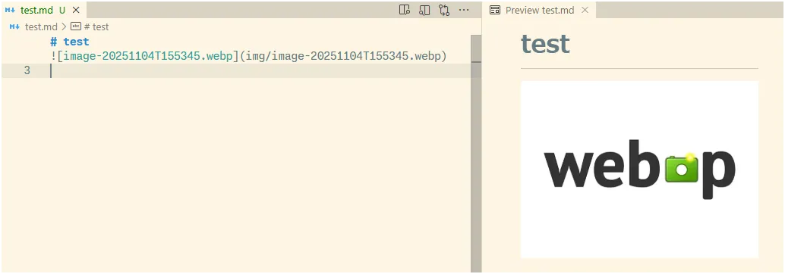

# WebP Image Paster

[English README](README.md)

クリップボード画像をWebP形式に変換し, Markdownファイルに直接貼り付けるVSCode拡張機能です。



## 目的,機能

- **ファイルサイズ削減** - PNGより小さく．ロスレスも対応
- **貼り付けパターンのカスタマイズ** - htmlタグを使った50%縮小貼り付けなど
- **画像名に日時を入れてユニークに**
- **ワークスペースルートを基準にした画像保存**
- **クロスプラットフォーム動作** - Windows、macOS、Linux，リモート(WSL、ssh、devcontainer)

## インストール

1. VSCode Marketplaceからインストール
2. 追加セットアップ不要

## 使い方

1. 画像をクリップボードにコピー
2. VSCodeでMarkdownファイルを開く
3. `Ctrl+V`（MacではCmd+V）を押す

**その他の方法:**

- コマンドパレット → "Paste as WebP in MD"

## ⚙️ 設定

詳細は設定の説明文を参照

```json
{
  "vsc-webp-paster.imageDir": "img",
  "vsc-webp-paster.quality": 80,
  "vsc-webp-paster.namingConvention": "image-${timestamp}",
  "vsc-webp-paster.insertPattern": "",
  "vsc-webp-paster.useWorkspaceRoot": false,
  "vsc-webp-paster.progressDelay": 0.3
}
```

## 📋 要件

- VSCode 1.108.0以上
- darwin-arm64, win32-x64, linux-x64, linux-arm64

**クリップボード取得方法:**

- **Windows**: PowerShell (.NET System.Windows.Forms.Clipboard)
- **macOS**: AppleScript (osascript)
- **Linux**: xclip (X11) または wl-paste (Wayland) - インストール必要
- **WSL / SSH**: 可能なら Windows 側 PowerShell を優先し, それ以外はクライアント側 OS の方式を使う

## 開発

```bash
npm ci
npm run compile
npm test
npm run test:e2e:code
npm run test:perf:e2e
npm run package:vsix
```

ローカルテスト:

- `npm test`: CI と同じ Extension Host E2E
- `npm run test:e2e:code`: `code` CLI でインストール済み VS Code を使うローカル専用 E2E
- `npm run test:perf:e2e`: activate 時間とメモリ差分を出力するローカル専用 perf E2E

## リリース

Marketplace 公開は `semantic-release` を起点に自動化します。
`main` で GitHub Release を作成し、その release workflow が 4 ターゲットを VS Code Marketplace へ publish します。

## 📝 ライセンス

MIT License
